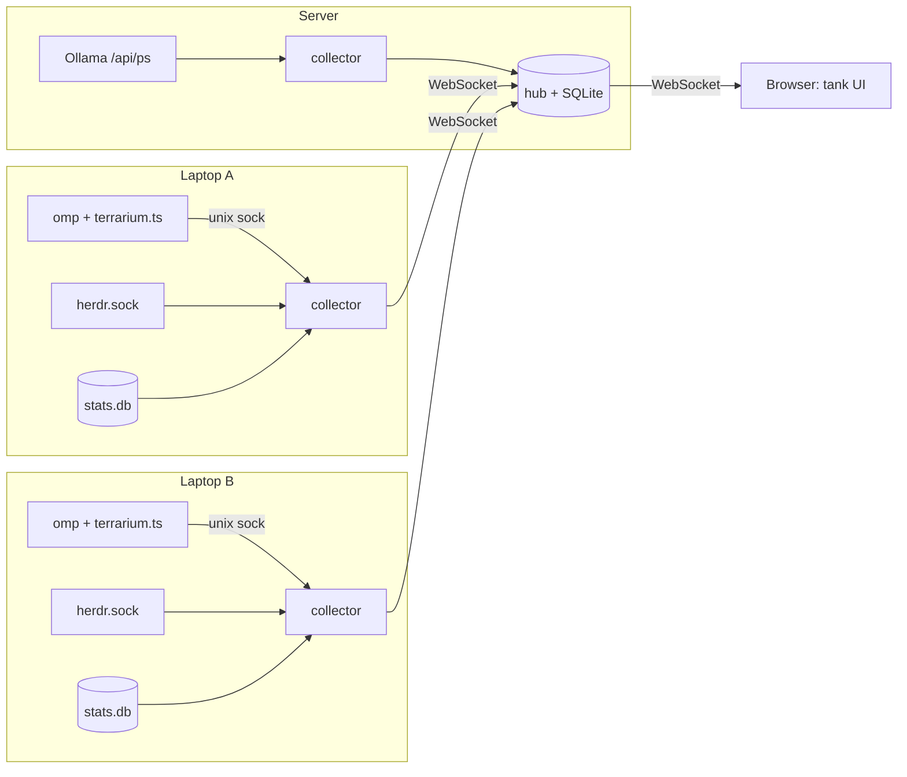

# Terrarium — plan

A full-screen web page on a laptop or tablet. It shows a glass tank where every
AI agent running on my machines is a small creature. When an omp agent reads a
file, the creature reads a file; when it runs bash, it hammers; when it waits
for me, it knocks on the glass. A HUD overlay shows Claude and Ollama usage
across all three machines.

## Goals

- Show every agent on **laptop A, laptop B and the server** in one place. The
  built-in `omp stats` dashboard only covers the machine it runs on.
- Update live: an agent changes state and the creature reacts within about a
  second.
- Show usage: tokens and cost per provider (Anthropic, Ollama) and per host, for
  today, the last 7 days and the last 30 days.
- Run well full screen on a tablet: no scrolling, readable from 2 m away, and
  the screen stays on.

## Non-goals

- Controlling agents from the tank (no prompting, killing or focusing). The
  tank is read-only, so a leaked URL cannot run commands on my machines.
- Showing prompt or response text. Events carry metadata only: tool name,
  state, token counts, model and project folder name.
- Replacing herdr or `omp stats`.

## Data sources (checked on this laptop)

| Source | What it gives | How to read it | Latency |
|---|---|---|---|
| **herdr socket** `~/.config/herdr/herdr.sock` (herdr 0.8.2, protocol 20) | Every agent pane (omp, claude, codex, opencode, …) with `agent_status` ∈ `idle, working, blocked, done, unknown`, plus `cwd` and `agent_session` (path to the omp session JSONL) | Newline-delimited JSON-RPC. `agent.list` gives a snapshot; `events.subscribe` with `pane.agent_detected` plus one `pane.agent_status_changed` subscription per `pane_id`. Subscribing was tested and returns `subscription_started`. | Push |
| **omp extension** in `~/.omp/agent/extensions/terrarium.ts` | Detailed activity: `agent_start`, `agent_end`, `tool_execution_start` / `tool_execution_end` (with `toolName`), `tool_approval_requested`, `session_start`, `session_shutdown`. The existing `herdr-omp-agent-state.ts` extension uses the same hooks. | The extension writes one JSON line per event to the local collector's unix socket and silently drops the event if the socket is missing. | Push |
| **omp stats DB** `~/.omp/stats.db` (SQLite) | Usage per assistant message: `provider` (`anthropic`, `ollama-cloud`), `model`, `folder`, `agent_type` (main or subagent), token counts, `cost_total`, `duration`, `ttft`, `stop_reason`. Also a `tool_calls` table. | Open read-only and poll by `timestamp` watermark. Alternative: `omp stats --json` (keys: `overall`, `byModel`, `byFolder`, `byAgentType`, `timeSeries`, `costSeries`, …). | Poll 30 s |
| **Ollama** (server, if local models run there) | Loaded models and VRAM use | `GET /api/ps` on the server | Poll 10 s |
| **Claude Code** `~/.claude/projects/*/*.jsonl` | Usage from sessions not run through omp. There are 0 projects on this laptop today. | Deferred until it is actually used | — |

Notes:

- `stats.db` is filled by omp from the session files. The collector reads it
  and never writes to it.
- Anthropic `cost_total` is the API-list-price equivalent. It is not the
  remaining quota of a Claude subscription. Plan limits (for example the
  5-hour window) are not in any local file I found, so they stay out of v1.
- Usage from direct `ollama run` calls outside omp is not recorded anywhere.
  Ollama only returns token counts per response. Only omp-routed Ollama usage
  is counted.

### Joining the sources

herdr's `agent_session.value` is the omp session file path. The omp extension
knows its own session file, and `stats.db.messages.session_file` uses the same
path. So the agent identity is:

```
agentId = <host>:<session_file>      # omp agents
agentId = <host>:herdr:<pane_id>     # non-omp agents seen only by herdr
```

Subagents (`agent_type != 'main'`) belong to their parent session and are shown
as baby creatures next to the parent.

## Architecture



- **collector** (one per machine, systemd user unit): reads the local sources,
  converts them into `TerrariumEvent`s and streams them to the hub. While the
  hub is unreachable it buffers events in a small ring and replays them on
  reconnect. It sends a heartbeat every 10 s.
- **hub** (server): accepts collectors, stores events and usage rollups in
  SQLite, holds the current world state in memory, sends a snapshot and then a
  delta stream to browsers, and serves the static frontend.
- **web**: the tank. It renders world state and needs no knowledge of omp or
  herdr.

### Stack

- **Bun + TypeScript** for collector, hub and extension. omp itself runs on Bun
  and extensions are TypeScript, so one language covers everything. Bun has
  built-in `bun:sqlite`, `Bun.serve` WebSockets and unix sockets, so no
  framework is needed.
- **Vite + PixiJS v8** for the 2D tank. It uses WebGL, keeps 60 fps on a
  tablet, and handles sprite sheets and particles.
- 3D is a later option: **Three.js** (or Threlte) with the same world-state
  contract. Only the renderer changes.
- One Bun workspace with three packages: `packages/protocol`,
  `packages/collector`, `packages/hub`, plus `packages/web` and
  `extensions/omp`.

### Network

Laptops leave the LAN, so the hub must be reachable from anywhere without
opening a public port. Options:

1. **Tailscale** on all three machines (recommended). It is not installed yet.
   The hub listens on the tailnet IP only, and devices are authenticated by the
   tailnet.
2. WireGuard, configured by hand.
3. `ssh -R` reverse tunnel from each laptop to the server. It needs no new
   daemon but breaks on network switches.

On every option, collectors also send a per-host bearer token (hub config), and
browsers use a read-only view token.

## Contract: `TerrariumEvent` v1

```ts
type TerrariumEvent = {
  v: 1;
  host: string;               // "laptop-a" | "laptop-b" | "server"
  ts: number;                 // ms epoch, source time
  agentId: string;            // see "Joining the sources"
  kind:
    | "agent.seen"            // new pane/session: agent kind, cwd folder name
    | "agent.state"           // idle | working | blocked | done | unknown | offline
    | "tool.start"            // tool name
    | "tool.end"              // tool name, isError
    | "turn.usage"            // provider, model, tokens in/out/cache, cost
    | "agent.gone"
    | "host.heartbeat";
  data: Record<string, unknown>;
};
```

The browser receives `WorldSnapshot` (hosts → agents → current activity, plus
usage rollups) followed by `WorldDelta`s. Neither the hub nor the browser ever
receives prompt or response text.

## Creatures and animations

Each host is a zone of the tank: laptop A on the left, laptop B on the right,
the server as the deep bottom layer. Each agent kind has its own species. Each
project folder gets a hat or colour so the same project is recognisable
across hosts.

| Signal | Animation |
|---|---|
| `idle` | Sleeping, with Zzz |
| `working`, no tool | Walking around, thinking bubble |
| `read`, `grep`, `glob`, `lsp` | Reading a scroll / sniffing the ground |
| `edit`, `write`, `ast_edit` | Building with blocks |
| `bash`, `eval` | Hammering on an anvil |
| `web_search`, fetch | Looking through a telescope |
| `task` (subagent spawn) | Egg hatches a baby creature |
| `todo` | Writing on a notepad |
| `blocked` / `ask` / approval | Knocking on the glass (attention: pulse + optional chime) |
| `done` | Celebration, then idle |
| `tool.end` with error | Trips and falls |
| host heartbeat lost | Zone dims and creatures turn to stone |

The top 10 tools on this laptop (from `stats.db`) are bash, read, edit, eval,
grep, hub, write, glob, web_search and todo. The table above covers all except
`hub`, which gets a messenger-bird animation.

The mapping lives in one table in `packages/web`. Any tool not in it falls back
to the "working" animation.

### HUD

- A bar per provider (Anthropic, Ollama) showing today's tokens and cost, with
  a 7-day sparkline.
- A small counter per host zone: active agents, tokens/min, and whether the
  host is online.
- Loaded Ollama models on the server, shown as glowing crystals in the server
  zone.

### Art

For v1, use free CC0 pixel sprite sheets (Kenney and similar). Every creature
needs the same set of animations (idle, walk, act, celebrate, fall, knock), so
species can be swapped without code changes. A custom art style can come after
the mechanics work.

## Milestones

Each milestone ends with something I can run and look at.

### M0 — Repo and decisions

- Bun workspace skeleton, `packages/protocol` with the event types, lint and
  format.
- Decide the network option (Tailscale or not) and the host names.
- **Done when:** `bun install && bun run typecheck` passes.

### M1 — Collector, local only

- Connect to the herdr socket: `agent.list` snapshot, then `events.subscribe`
  (`pane.agent_detected` plus one `pane.agent_status_changed` per pane).
  Subscribe again when new panes appear.
- Poll `stats.db` read-only for new `messages` rows and emit `turn.usage`.
- `collector --stdout` prints normalized events.
- **Done when:** starting an omp session in herdr and giving it a prompt prints
  `agent.seen` → `agent.state working` → `turn.usage` → `agent.state done`.

### M2 — omp extension

- `extensions/omp/terrarium.ts` hooks the omp events listed above and writes
  JSON lines to `$XDG_RUNTIME_DIR/terrarium.sock`.
- The collector merges them with herdr state, keyed by `agentId`.
- **Done when:** a prompt that runs `read`, then `edit`, then `bash` produces
  exactly those three `tool.start`/`tool.end` pairs, in that order.

### M3 — Hub and a plain view

- Hub on the server: collector WebSocket ingest with token auth, SQLite
  storage, snapshot plus delta WebSocket for browsers.
- The web page shows a plain table of hosts, agents, current tool and usage.
  No sprites yet.
- **Done when:** the table on a tablet updates live while an agent works on
  laptop A.

### M4 — The tank (2D)

- A PixiJS scene with the three zones, a creature state machine driven by
  `WorldDelta`, and the tool → animation table.
- Fullscreen API, Screen Wake Lock API, and a PWA manifest so the page can be
  installed on the tablet.
- **Done when:** watching the tablet shows which agent is reading, editing or
  waiting without reading any text.

### M5 — All three machines

- A systemd user unit for the collector, an install script that also copies the
  omp extension, a per-host token, and heartbeat plus offline zone handling.
- Ring-buffer replay when laptops reconnect after sleep.
- **Done when:** closing laptop B's lid turns its zone to stone. Reopening it
  brings the zone back, and usage made while it was offline appears in the
  totals.

### M6 — Usage HUD and history

- Rollups per host, provider and model for day, week and month, stored on the
  hub.
- Ollama `/api/ps` crystals.
- **Done when:** the HUD totals match `omp stats --json` `overall` summed
  across hosts.

### M7 — Polish and stretch

- Sounds (off by default), a day/night cycle based on local time, and a
  per-project hat editor.
- A Three.js renderer behind the same world-state contract.
- Claude Code JSONL as an additional source, if I start using it.

## Risks

| Risk | Mitigation |
|---|---|
| herdr socket protocol changes (currently protocol 20) | Check `protocol` from `herdr status` at connect and log a clear error on mismatch. All herdr code lives in one adapter file. |
| omp extension API or `stats.db` schema changes (omp 18.4.3 today) | Open the DB read-only, select only the columns listed above, and let the extension silently drop events it cannot send. Each source is a separate adapter. |
| Double counting usage (extension `turn.usage` vs `stats.db`) | `stats.db` is the only source for usage numbers. The extension sends activity only. |
| Laptops asleep or offline | Heartbeats, an offline state, and replay from `stats.db` by watermark after reconnect |
| Privacy (project names show on a tablet in the room) | A per-folder alias map in hub config. Prompt and response text is never collected. |
| Tablet performance | Sprite atlases, a hard cap on particles, and a 30 fps fallback when `requestAnimationFrame` falls behind |

## Open questions

- Tailscale: OK to install on all three machines?
- Which tablet (iPad / Android)? This affects PWA install and the wake lock.
- Should the server's own agents (if any run there under herdr) be the bottom
  layer, or have a zone of their own?
- Are Claude subscription limits (the 5-hour window) wanted? They are not
  available locally. Getting them would need scraping or an official endpoint,
  if one exists.
