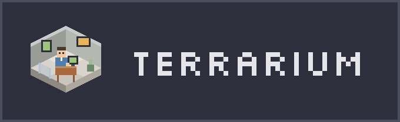
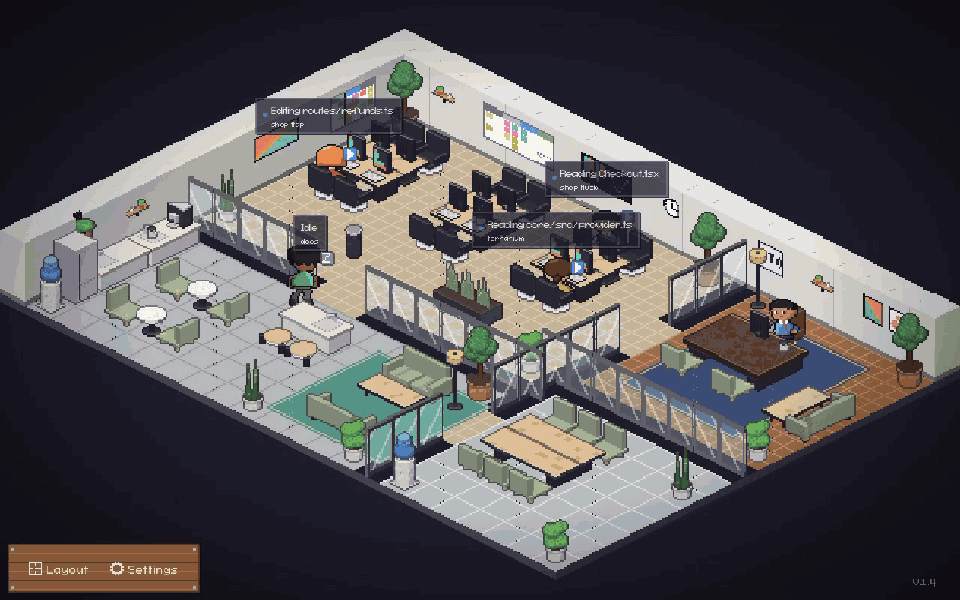
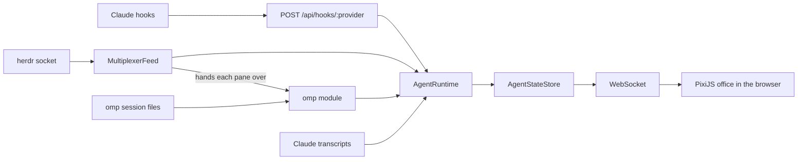

<h1 align="center">
  
</h1>

<p align="center">Every AI coding agent on your machine, as a pixel-art character in an isometric office.</p>

<p align="center">
  
</p>

Terrarium watches the agents running on your machine and turns each one into a character. A character sits at a desk and types while its agent edits files or runs commands, and reads while it searches. When the agent needs you, the character walks to the CTO's office and waits in line. When it finishes, it goes to the lounge.

Terrarium is a fork of [Pixel Agents](https://github.com/pixel-agents-hq/pixel-agents) v1.4.1. It keeps the Pixel Agents server, protocol and VS Code adapter, and changes three things:

- **herdr support.** A provider for the [herdr](https://github.com/herdrdev/herdr) terminal multiplexer shows every agent herdr manages, with tool activity for omp agents.
- **A new office.** The renderer is now PixiJS, drawing 2:1 isometric pixel art with glass-walled rooms, a CTO who works through an approval queue, a lounge and a kitchen.
- **Status badges.** Every character carries a badge for its state: working, needs approval, waiting for input, done, or idle.

The code and the CLI are still named `pixel-agents`, and nothing from this fork is published to npm or the VS Code Marketplace. `npx pixel-agents` and the Marketplace extension install upstream Pixel Agents, which has no herdr support. Run Terrarium from source (see [Getting started](#getting-started)).

## Features

- **One agent, one character.** Each agent gets its own character with a stable color, named after its herdr workspace (and tab, when a workspace hosts several agents).
- **Live activity.** Characters type for edits and commands, read for searches and fetches, and show the agent's own one-line intent ("Reading core/src/provider.ts") above their head.
- **CTO approval queue.** An agent that is blocked on a permission prompt, or waiting for your input, joins the queue at the CTO's office. The first few sit in the visitor chairs and the rest line up at the door. While anyone waits at the door, the line rotates, so the agent that has sat longest gives up its chair.
- **Lounge.** Idle agents leave their desks and sit on the sofas around the coffee table.
- **Status badges and context gauge.** A badge above every character shows its state. For Claude Code agents, a gauge shows how full the context window is.
- **Sub-agents and Agent Teams** (Claude Code). Sub-agents and teammates appear as their own characters next to the agent that spawned them.
- **Office editor.** Paint floors, walls and carpets, place and recolor furniture, add pets, and paint named areas that new agents sit in.
- **Sound notifications.** An optional chime when an agent finishes its turn or asks for permission.

## Providers

What the office shows comes from provider modules, and any combination of them can run in one server. There are two kinds: a **multiplexer** module knows which agents a terminal multiplexer hosts, and an **agent** module knows what one agent CLI is doing. Pick them with `--provider`, comma-separated. The choice is saved in `~/.pixel-agents/config.json` and reused by later runs:

| Module             | Kind        | What you see                                                                                                | How it works                                                                                                                                                   |
| ------------------ | ----------- | ----------------------------------------------------------------------------------------------------------- | -------------------------------------------------------------------------------------------------------------------------------------------------------------- |
| `herdr`            | multiplexer | Every agent in a herdr pane (omp, Claude Code, Codex, opencode, …) with its status, name and task.          | Reads herdr's JSON-RPC socket at `~/.config/herdr/herdr.sock`. Hands each pane to the agent module for its kind, when that module runs, for the tool activity. |
| `omp`              | agent       | omp sessions with their tool activity ("Reading PLAN.md"), working while a turn runs and idle when it ends. | Tails the transcripts in omp's session store (`~/.omp/agent/sessions/`), with or without herdr.                                                                |
| `claude` (default) | agent       | Claude Code sessions in the current workspace, or every session with **Watch All Sessions**.                | Installs hooks into `~/.claude/settings.json` after you approve it in the app, and falls back to reading Claude's JSONL transcripts.                           |

With `herdr,omp`, an omp session running in a herdr pane is one character: omp supplies what it is doing, herdr its name, its task and any pending approval. omp sessions outside herdr show up too. Agents in herdr panes whose CLI has no running agent module show their status only. Only the Claude module writes anything outside `~/.pixel-agents/`.

## Getting started

Requirements: Node.js 20 or later, and either [herdr](https://github.com/herdrdev/herdr) running locally or [Claude Code](https://docs.anthropic.com/en/docs/claude-code).

```bash
git clone https://github.com/Luckystrike561/terrarium.git
cd terrarium
npm install
npm run build
```

With herdr and omp:

```bash
node dist/cli.js --provider herdr,omp
```

With Claude Code, run it from the workspace whose sessions you want to see:

```bash
cd /path/to/your/project
node /path/to/terrarium/dist/cli.js
```

The server picks a free port and prints a URL like `http://127.0.0.1:43123/?token=…`. Open it in a browser. If herdr is not running yet, the server keeps retrying in the background and the office fills in once herdr is up.

With [devbox](https://www.jetify.com/devbox), `devbox run install` builds everything and `devbox run start` starts the herdr and omp modules on `127.0.0.1:8790`.

### Options

```bash
node dist/cli.js --provider herdr,omp  # any of claude, omp, herdr; saved for later runs
node dist/cli.js --port 3100           # fixed port instead of a free one
node dist/cli.js --host 127.0.0.1      # bind address (default 127.0.0.1)
node dist/cli.js --help
```

Binding to `0.0.0.0` exposes the office and its WebSocket to your network. Do it only on a trusted network.

### The token in the URL

Anyone who can reach the server can watch the office. Changing hook installation (which edits your agent's own settings file, such as `~/.claude/settings.json`) is only allowed for a browser that opened the URL with its `?token=`. Treat that URL as a secret: the token works from anywhere the server is reachable, and it also lands in your browser history and the server's request log.

### VS Code extension

The VS Code extension from Pixel Agents still builds from this tree (press **F5** to launch an Extension Development Host) and renders the same office. It launches Claude Code terminals, and it runs the same saved set of provider modules as the standalone server.

## Customizing the office

Click **Layout** to edit the office:

- Paint floors, walls and carpets, with color controls.
- Place, rotate, recolor and remove furniture. Desks with an agent at them switch their electronics on.
- Add pets and click them to interact.
- Paint named **Areas** and map workspace folders to them, so new agents sit in their area.
- Undo and redo, then save, or import and export the layout as JSON.

Layouts grow up to 64×64 tiles by clicking the ghost border around the grid. The layout is saved to `~/.pixel-agents/layout.json`.

Use **Settings → Add Asset Directory** to load external characters, pets and furniture. See [docs/external-assets.md](docs/external-assets.md) for the furniture manifest format.

The bundled furniture, characters and default office are generated from code: `npx tsx scripts/iso-art/generate.ts` rewrites the sprites, and `npx tsx scripts/iso-art/layout.ts` rebuilds the default layout.

## How it works



Each module turns its source into a shared `AgentEvent` model (tool started, permission requested, turn ended, …), and the runtime routes every event by the module it came from. `AgentRuntime` updates the state store, and the server pushes typed messages over a WebSocket to the React and PixiJS front end. The wire protocol is defined in [`core/asyncapi.yaml`](core/asyncapi.yaml).

Terrarium never modifies your agents. Its own data lives in `~/.pixel-agents/`, and the only file it writes elsewhere is `~/.claude/settings.json`, when you approve Claude hooks.

### Repository layout

- **`core/`**: provider, transport and schema interfaces, plus the AsyncAPI message contract. No runtime side effects.
- **`server/`**: Fastify server, agent runtime, persistence, the provider modules (`server/src/providers/<id>/`) and their registry, and the standalone CLI.
- **`webview-ui/`**: React 19 and PixiJS front end, served by the standalone server or embedded in VS Code.
- **`adapters/vscode/`**: the VS Code extension.

[CLAUDE.md](CLAUDE.md) is the detailed architecture reference and [CONTEXT.md](CONTEXT.md) the glossary.

## Development

```bash
npm install
npm run build          # generate protocol types, type-check, lint, bundle
npm run check-types
npm run lint
npm test               # server and webview unit tests
npm run e2e            # Playwright, against VS Code and the standalone server
```

`npm run demo:record` re-records the GIF at the top of this page. It plays a scripted herdr session through the real standalone server (needs `npm run build` and `ffmpeg`) and writes `docs/media/demo.gif`.

See [CONTRIBUTING.md](CONTRIBUTING.md) for the workflow and [e2e/README.md](e2e/README.md) for the end-to-end suite.

## Troubleshooting

- **The office stays empty with `--provider herdr`.** Check that herdr is running and that `~/.config/herdr/herdr.sock` exists. The server logs `Herdr not reachable` until it can connect.
- **An agent in a herdr pane shows a status but never a tool.** Its CLI has no running agent module: add it to `--provider` (for omp, `--provider herdr,omp`). With omp running, herdr must also report the pane's session file, which it does once omp has started a session.
- **A Claude session is missing.** Check that **Settings → Instant Detection (Hooks)** is on and that the session belongs to the current workspace, or turn on **Watch All Sessions**.
- **The office looks disconnected.** **Settings → Debug View** shows the server connection and the latest data for each agent.

## License and credits

MIT, see [LICENSE](LICENSE). Terrarium is built on [Pixel Agents](https://github.com/pixel-agents-hq/pixel-agents) by Pablo De Lucca and its contributors.
