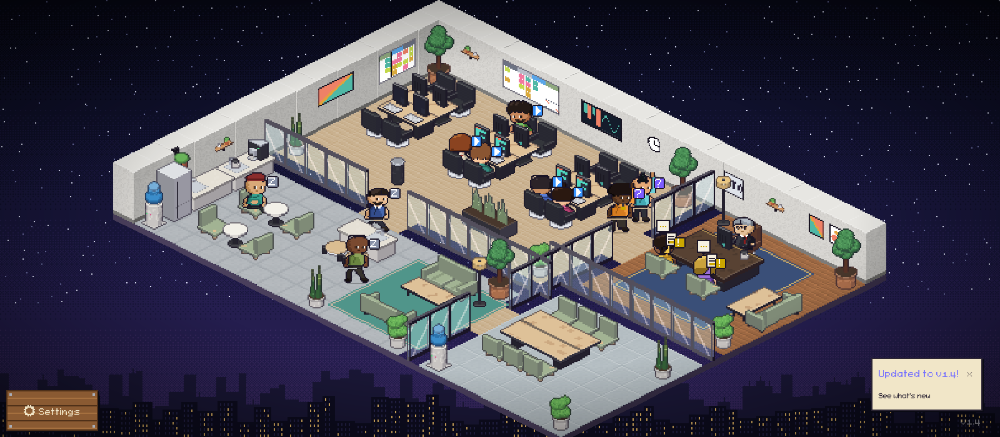

# Art direction

The target look for everything drawn in the office: characters, furniture, floors, walls, status badges, speech bubbles and the HUD. New art follows this note. Art that cannot follow it changes the note in the same pull request.

## Decisions

- **Everything stays generated from code.** Characters, furniture and floors are written by `scripts/iso-art/` (`npx tsx scripts/iso-art/generate.ts`), walls are drawn procedurally at runtime (`webview-ui/src/office/isoWalls.ts`). No hand-drawn sheets and no third-party asset packs: the generator keeps every asset reviewable as a diff, reproducible, and free of licence questions.
- **One style: chunky iso pixel art at night.** A cozy late-shift office in 2:1 isometric projection, lit warm inside against a deep indigo city outside. Characters are chunky and readable first, detailed second: a viewer across the room must tell who is working, who is waiting and who needs approval without reading a badge.

## Pixel grid and projection

- 2:1 isometric. A floor tile is a 32×16 diamond. One world unit of height is one sprite pixel: desk tops at 12, chair seats at 6, back walls 40 tall, glass partitions 30.
- Nearest-neighbour sampling only. No anti-aliasing, no blur, no sub-pixel placement, no smooth gradients. Shading comes in hard bands.
- One sprite pixel is one art pixel. Never scale a sprite inside its sheet.

## Light

One key light from the screen's upper left.

| Surface                                       | Brightness |
| --------------------------------------------- | ---------- |
| Top faces                                     | 100%       |
| Left faces (facing +row, screen lower left)   | 70%        |
| Right faces (facing +col, screen lower right) | 45%        |

- **Shadows shift toward cool violet `#1f1830`**, never toward black. Brightness is quantized into six bands (`lit()` in `scripts/iso-art/lib/scene.ts`).
- **Rim light**: one lighter pixel row on the top front edges of boxes.
- **Characters** follow the same light: the figure's screen-right side is the shaded side (`S`/`k`/`P`/`F` template letters), the left side carries the light tone.
- **Contact shadows**: characters stand on a translucent `#00000040` ground shadow, furniture casts its traced shadow on the floor.

## Outline

- **Ink is `#1a1426`.** It is the outline of characters, furniture silhouettes, badges and bubbles.
- **Characters** get a full 1 px outline, including the inner line between parts that overlap (an arm over the torso, a sleeve over a hand), so poses read at 1×.
- **Furniture** gets a selective outline: silhouette pixels darken toward ink, inner edges are drawn by the light bands instead.
- **Floors and walls** have no outline. Tiles read through the light: seams and bevels, not lines.

## Palette

Base colours are the fully lit (top face) tone. Side tones are derived from them by the light, never picked by hand. Keep bases mid to light so the shaded faces don't collapse into the shadow colour.

| Role                | Colours                                           |
| ------------------- | ------------------------------------------------- |
| Ink (outlines)      | `#1a1426`                                         |
| Text ink on paper   | `#2b2433`                                         |
| Shadow tint         | `#1f1830`                                         |
| Wood (desks, plank) | `#c98b52` `#a8673a` `#7a4528`                     |
| Upholstery          | sage `#a8b89a`, grey `#8b8796`, leather `#9a5a3c` |
| Metal               | `#dfe3ea` `#b7bcc8` `#6d7383`                     |
| Paper               | `#f6f1e2` `#f1e6c8` `#e2d2a8`                     |
| Plants              | `#8fd36a` `#5fae4e` `#3e7d3a`                     |
| Night outside       | `#090a1a` → `#36275e`, lit windows `#f0c06a`      |

**State colours** are shared by status badges, bubbles and the HUD, and nothing else uses them:

| State             | Colour           |
| ----------------- | ---------------- |
| Working           | blue `#3794ff`   |
| Needs approval    | amber `#cca700`  |
| Waiting for input | violet `#7c5cff` |
| Done              | green `#44bb66`  |
| Idle              | grey `#8891a8`   |

## Characters

A frame is 24×40. The feet touch the bottom centre of the frame. Seated frames sit 7 px lower, on a chair seat at height 6.

**Proportions.** About 2.2 heads tall: head and hair about 18 px, torso 12, legs 10. Heads are big and round, faces carry two-pixel eyes (white plus pupil) and a one-pixel mouth.

**Views.** Row 0 faces DOWN (3/4 front, screen lower left), row 1 faces UP (3/4 back, screen upper right), row 2 faces RIGHT and is row 0 mirrored. LEFT is row 1 mirrored at runtime.

**Poses.** Every sheet carries the same frames, in this order (`CHARACTER_FRAMES` in `core/src/assets/constants.ts`):

| Frames                                | Pose                                                                | Used for                                         |
| ------------------------------------- | ------------------------------------------------------------------- | ------------------------------------------------ |
| `walk1` `walk2` `walk3`               | walk cycle, `walk2` is the passing pose                             | walking                                          |
| `type1` `type2`                       | seated, hands on the keyboard                                       | writing tools                                    |
| `read1` `read2`                       | seated, holding a sheet                                             | reading tools                                    |
| `idle1` `idle2`                       | standing, breathing: the second frame exhales one pixel lower       | standing idle                                    |
| `rest1` `rest2`                       | seated, leaning back, hands in lap, eyes closed on the second frame | lounge sofas, resting at a desk, the CTO's couch |
| `raiseHand1` `raiseHand2`             | standing, one hand raised, waving                                   | waiting for input, at the CTO's door             |
| `raiseHandSeated1` `raiseHandSeated2` | seated, one hand raised, waving                                     | waiting for input, on a CTO visitor chair        |
| `holdForm1` `holdForm2`               | standing, holding up a form with an amber mark                      | needs approval, at the CTO's door                |
| `holdFormSeated1` `holdFormSeated2`   | seated, holding up a form with an amber mark                        | needs approval, on a CTO visitor chair           |

Only working agents type or read. An agent that sits without working rests, and an agent that needs the human shows it with its body: a raised hand asks a question, a held-up form asks for a signature.

**Variety.** Twelve distinct workers ship (`char_0.png` to `char_11.png`), so a twelve-agent office has no two alike. Each one differs from every other in at least two of: build, hair, outfit cut, accessory, and its dominant outfit colour is distinct at 1×. Hue-shifted copies only appear from the thirteenth agent on. The CTO has a sheet of its own (`cto.png`) that no agent uses.

## Furniture

- Modelled as primitives (boxes, cylinders, spheres) and ray traced by `IsoScene` (`scripts/iso-art/lib/scene.ts`), which applies the light, the shadow tint, the selective outline and the rim light above. Colours come from `PAL` (`scripts/iso-art/lib/palette.ts`).
- An item with footprint fw×fh is `(fw+fh)*16` px wide and its floor diamond touches the image's left, right and bottom edges.
- Electronics have an off and an on state. Screens glow `#7fe0c8` or `#5aa6e8` when on.

## Floors

- Floors are 16×16 grayscale patterns, colourized per tile, then projected onto the 32×16 diamond. They are generated by `scripts/iso-art/floors.ts`.
- A pattern draws a material, not a grid. Each cell carries a bright seam along its top and left edge (the shared boundary with the next cell when tiled) and a darker inset line along its bottom and right edge, so slabs, planks, bricks and tiles read as slightly raised pieces. `floor_0`–`floor_8` keep a fixed index-to-material mapping that the default layout and any saved layout rely on: `floor_0` plain polished slab, `floor_1` large pale tile (bright seam), `floor_2` large tile (dark grout), `floor_3` small square tile (dark grout), `floor_4` wood planks with grain, `floor_5` running-bond brick (bright mortar), `floor_6` aligned brick (dark mortar), `floor_7` fine checkerboard, `floor_8` coarse checkerboard.
- Texture stays quiet: value noise of at most two bands, so characters and furniture keep the contrast.

## Walls

- **Back walls** are 40 px boxes lit from the same direction as furniture but softer, because a wall face is the largest surface in the room and full furniture contrast would swamp it: the cap at 118% of the wall colour with a brighter rim pixel on its front edges, the left face at 95%, the right face at 78%, a baseboard at 55%, and a quiet hashed plaster texture of at most one band on the faces.
- **Glass partitions** stand 30 px high: an ink-dark frame, a pale blue pane at 30% opacity and a diagonal white sheen, so the rooms behind stay visible.

## Badges and bubbles

- Small sprites (9×9 for badges, 11×13 for bubbles), `webview-ui/src/office/sprites/status-*.json` and `bubble-*.json`, drawn in the ink outline `#1a1426`.
- A **badge** is a filled state-colour plate with a white (`#ffffff`) glyph: ▶ working, ! needs approval, ? waiting for input, ✓ done, Z idle.
- A **bubble** is paper (`#f6f1e2`) with an ink outline and a tail pointing at the head, carrying the state colour in its glyph. The pet-petted heart bubble follows the same paper-and-ink shape with its own pink (`#e64566`) glyph: it is a reaction, not a state indicator, so it sits outside the state-colour table.

## HUD

- **The HUD is furnished like the office.** It is made of the same materials as the room: modals and notices are paper memos pinned with a square tack (`ui/Modal.tsx`, `ChangelogModal.tsx`, `MigrationNotice.tsx`: `.paper-sheet` plus a `.paper-pin`), and tooltips, toasts and in-world labels are paper tags (`Tooltip.tsx`, `VersionIndicator.tsx`, `ConnectionIndicator.tsx`, `ToolOverlay.tsx`'s activity label, the greeter's `IntroBubble.tsx`: `.paper-tag`, ink-bordered). There is no flat dark panel that belongs to no object in the room.
- **Font**: FS Pixel Sans, at the theme's pixel sizes.
- **Shape**: square corners, 2 px borders in wood-dark or ink, hard 2 px offset shadows (`2px 2px 0px`) with no blur, and no gradients except hard-edged bands such as wood grain.
- **Colours**: wood, paper, ink and the state colours above. `npm run lint` enforces it: colour literals only in `constants.ts` and the CSS variables, pixel shadows, and the pixel font.

## References

- [The default office](media/art-direction/office.png) at 1600×700 with twelve agents: five working, two needing approval, two waiting for input, three idle. This is the target state.
- [The office before this direction](media/art-direction/office-before.png), same scene and size, for comparison.
- [The twelve workers and the CTO](media/art-direction/characters.png), every frame of every sheet at 3×, one sheet per band (front, back and side rows).
- Inspiration only, no assets copied: Habbo Hotel (2:1 rooms, outlined furniture, readable figures) and Stardew Valley (warm palettes, big heads, chunky outlines).

## Checklist for new art

1. Generated by `scripts/iso-art/` or drawn procedurally. Regenerating reproduces the committed assets with no diff.
2. Lit from the upper left, shadows toward `#1f1830`, colours from the palette above.
3. Outlined in ink as the section above says for its kind.
4. Characters: every frame of `CHARACTER_FRAMES`, feet at the bottom centre, seated frames 7 px lower.
5. Furniture: the footprint anchor contract above, and a bump of the default layout `REVISION` if an id or a footprint changes.
